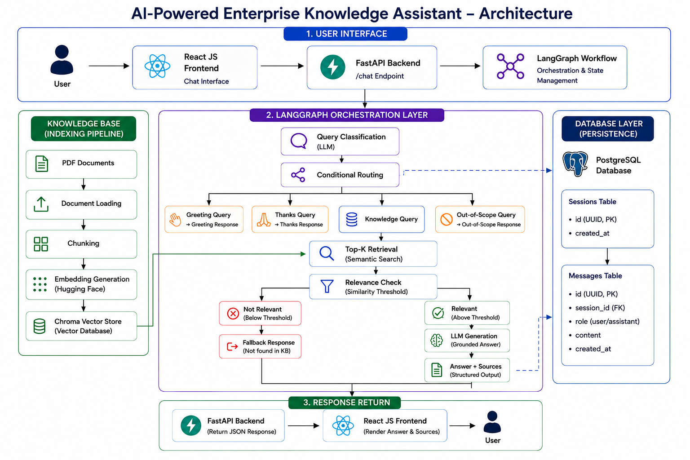

# AI-Powered Enterprise Knowledge Assistant

## Overview

An AI-powered enterprise knowledge assistant built using Retrieval-Augmented
Generation (RAG). Users can ask questions about enterprise documents, and the
system retrieves relevant information from the knowledge base and generates
grounded answers using an LLM.

The application consists of a FastAPI backend and React frontend, with
LangGraph used to orchestrate the query-processing workflow.



## Key Features

- React-based chat interface
- FastAPI `/chat` API
- PDF document ingestion
- Document chunking
- Hugging Face embedding generation
- Chroma vector database
- Top-K semantic retrieval
- Similarity-distance threshold filtering
- Query classification
- Conditional routing with LangGraph
- Grounded LLM answer generation
- Structured LLM output using Pydantic
- Source citation from document metadata
- Fallback response for irrelevant queries
- Out-of-scope query handling

## Frontend

React (Vite) chat interface that sends user questions to the backend
and renders the returned answer, sources, or a "not found" fallback.

```text
frontend/
└── src/
    ├── components/    # Chatinput, Chatwindow, Navbar
    ├── pages/         # ChatPage
    └── services/      # api.js — centralized Axios instance
```

- All API calls go through `services/api.js` rather than being called
  directly from components, so the backend base URL and endpoint paths
  live in one place.
- Styling uses CSS custom properties defined in `index.css` (color
  tokens, fonts) so the theme can be adjusted without touching
  component files.
## Backend

FastAPI service exposing the `/chat` endpoint that the frontend calls.
Owns document ingestion, chunking, embedding, vector storage, retrieval,
and LangGraph-orchestrated answer generation.

```text
backend/
└── app/
    ├── core/          # config, settings, shared utilities
    ├── graph/          # LangGraph workflow definition
    ├── loaders/        # document loading  
    ├── services/       # chunking, retrieval, and application logic
    └── vectorstore/    # embedding + vector DB integration

```

The backend currently provides a working `/chat` endpoint with CORS enabled for 
the frontend. The RAG pipeline and LangGraph workflow are integrated into the backend

### RAG Core Pipeline

📄 **Document Loading** → 🧩 **Chunking** → 🔢 **Embedding** → 🗄️ **Vector Store** → 🔍 **Similarity Search** → 🧠 **LLM Generation (LangGraph)** → 💬 **Answer + Sources**

### LangGraph Workflow

```text
START
  ↓
Query Classification
  ↓
Conditional Routing
  ├── Greeting → Greeting Response → END  
  ├── Thanks → Thank Response → END
  ├── Out of Scope → Scope Response → END
  │
  └── Knowledge
        ↓
    Retrieve Documents
        ↓
    Relevance Check
       ├── Not Relevant → Fallback Response → END
       │
       └── Relevant
             ↓
       LLM Generation
             ↓
        Answer + Sources
             ↓
            END

```

## Installation

### Backend

The backend uses `uv` for dependency management.

```bash
# Install uv if not already installed
curl -LsSf https://astral.sh/uv/install.sh | sh

cd backend
uv sync
uv run uvicorn app.main:app --reload --port 8000
```

### Frontend

```bash
cd frontend
npm install
npm run dev
```

## Environment Variables

Create a `.env` file inside the `backend/` directory:

```env
GEMINI_API_KEY=your_gemini_api_key
HF_TOKEN=your_huggingface_token
LANGSMITH_API_KEY=your_langsmith_api_key
LANGSMITH_TRACING=false
LANGCHAIN_PROJECT=your_project_name

```

## API

### `POST /chat`

Accepts a user question and returns a generated answer.

**Request**
```json
{ "question": "What is the reimbursement policy for conference travel?" }
```

**Response**
```json
{
  "answer": "The reimbursement policy ...",
  "source": [
    "reimbursement_policy_detailed.pdf"
  ]
}
```


